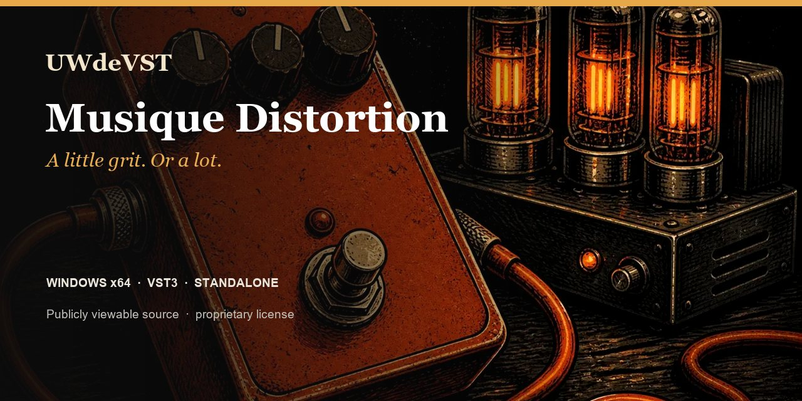

<!-- UWDEVST-SHOWCASE:START -->

  

<h1 align="center">Musique Distortion</h1>

<strong>A little grit. Or a lot.</strong> From subtle drive to digital textures, add weight and character to your sounds.

  <a href="https://unicorsoundengine.com/en/plugins/fx-distortion#listen">Listen</a> ·
  <a href="https://unicorsoundengine.com/en/plugins/fx-distortion#install">Download</a> ·
  <a href="https://unicorsoundengine.com/en">Full collection</a> ·
  <a href="https://github.com/unicornwhodev/fx-distortion/issues/new/choose">Report an issue</a>

**Windows x64 · VST3 · Standalone**

- Overdrive, Fuzz, Exciter, Bit Crusher and Console
- Drive, Tone, Blend and Mix
- 18 factory presets

> **Publicly viewable source — proprietary license.** Official binaries are free for individuals and organizations with no more than EUR 100,000 in worldwide consolidated gross revenue. Modification and redistribution are not permitted. Professional use above that threshold requires a paid written license. [Read the license](https://unicorsoundengine.com/en/license) or [request a commercial license](https://unicorsoundengine.com/en/contact).

The license included with each tagged release governs that release. The v1.0 license applies prospectively and does not withdraw permissions already granted on earlier releases.
<!-- UWDEVST-SHOWCASE:END -->

---

# Musique Distortion

Musique Distortion is a Windows drive, saturation and character effect for adding harmonic weight, edge or lo-fi texture. It is available as a Standalone application and a VST3 plug-in.

## Formats

- Windows x64 Standalone
- Windows x64 VST3

## Install a release

1. Download the Windows installer or portable ZIP from this repository's Releases page.
2. Run the installer, or extract the ZIP and copy the complete .vst3 bundle to a VST3 location scanned by your host.
3. Rescan plug-ins in the host, then insert the effect on the track or bus you want to process.

## Distortion families

| Family | Typical result |
| --- | --- |
| Overdrive | Controlled drive for buses, guitars and general edge. |
| Fuzz | Dense, gated and octave-capable distortion. |
| Exciter | Presence and air enhancement with adjustable harmonic drive. |
| Bit Crusher | Digital reduction, jitter and retro texture. |
| Console | Saturation and transformer-style glue. |

Drive, Tone, Blend, Mix and Output form the common workflow. The active family exposes focused controls such as bias, body, headroom, gate, octave, frequency, jitter or glue.

## Factory presets

The 18 factory presets include Soft Tube, Modern Crunch, Fuzz Wall, Bit Crush Lead, Bass Saturate, Clean Harmonics and dedicated overdrive, exciter, crusher and console starts. Use Mix and Output to keep comparisons level-matched.

## Build from source

Requirements: Windows x64, PowerShell, Git, CMake 3.22 or later, Visual Studio 2022 (or Build Tools) with Desktop development with C++, and JUCE 8.0.4.

~~~powershell
.\_build_all.ps1 -Configuration Release -BootstrapJuce
~~~

To use an existing JUCE 8.0.4 checkout:

~~~powershell
.\_build_all.ps1 -Configuration Release -JuceDir C:\Dev\JUCE
~~~

The build produces Standalone and VST3 artefacts.

## Package a local build

~~~powershell
.\_package_release.ps1 -Configuration Release -BootstrapJuce
~~~

The script creates a portable Windows package and, when Inno Setup 6 is installed, a Windows installer. Use the SkipInstaller option when an installer is not required.

## Repository contents

| Path | Purpose |
| --- | --- |
| Source/ | Plug-in source, effect engines and visual assets |
| Presets/ | Factory preset bank |
| FXShared/ | Local shared UI and audio helpers required by this plug-in |
| installer/ | Windows installer definition |

## Licence and support

The source code is publicly viewable under a proprietary license. Viewing and private compilation of strictly unchanged source are permitted; modification and redistribution are not. See [LICENSE.md](LICENSE.md). For a released-build issue, open an issue with the Windows version, host name/version, plug-in format and steps to reproduce it.
